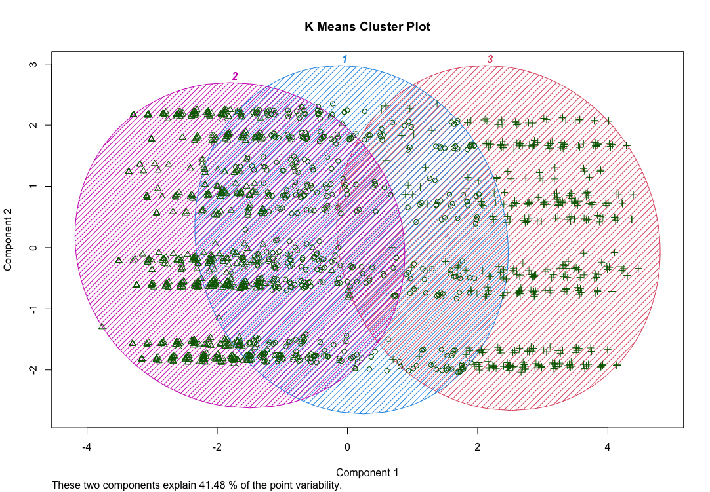

# APAN 6010 Final Project

## David Ingram

### Kmeans Clustering

Due to the large amount of categorical variables dummy variables were created to complete the Kmeans clustering. This was accomplished using
the package recipes to speed the task; the code example is below.

```
recipe.kmeans <- recipe(~ ., data = airline.kmeans) %>%
  step_dummy(all_nominal_predictors(), one_hot = TRUE) %>%
  step_scale(all_nominal_predictors()) %>%
  prep()

kmeans.baked <- bake(recipe.kmeans, new_data = airline.kmeans)
```

Doing Kmeans with binary, and or dummy variables is not prefered but out of necessity was the approach taken.

Below is a photo of the cluster plots, which are admittley hard to read, but does show when and why cluster analysis is needed.

